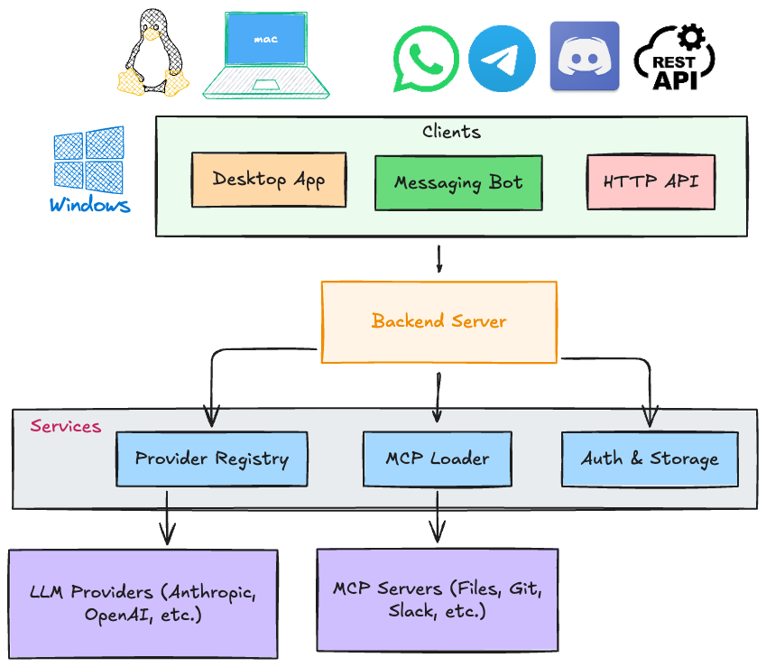

# OpenClawd

Multi-provider AI platform. 20+ LLMs. MCP integrations. Desktop + messaging. Voice input. Token analytics.

## Architecture



```bash
npx openclawd-cli
```

## Install

```bash
git clone https://github.com/rohitg00/openclawd
cd openclawd && ./setup.sh
```

Add your API key to `.env`:

```bash
ANTHROPIC_API_KEY=sk-ant-xxx
```

Run:

```bash
cd server && npm start   # Terminal 1
npm start                # Terminal 2
```

## Providers

Works with any provider. Add API keys to `.env`:

```
ANTHROPIC_API_KEY      # Claude (default)
OPENAI_API_KEY         # GPT-4o, o1
GEMINI_API_KEY         # Gemini 2.0
GROQ_API_KEY           # Ultra-fast Llama
OPENROUTER_API_KEY     # 200+ models
VENICE_API_KEY         # Privacy-focused
DEEPSEEK_API_KEY       # DeepSeek R1
XAI_API_KEY            # Grok
MISTRAL_API_KEY        # Mistral/Codestral
```

Ollama models auto-discovered when running locally.

## Model Fallback

Automatic failover when a provider fails. Configure in Settings > General or `.env`:

```
FALLBACK_PROVIDER=openai
FALLBACK_MODEL=gpt-4o
```

When the primary provider errors out, OpenClawd automatically retries with the fallback.

## Token Usage Dashboard

Settings > Usage tab shows:

- Summary cards (total tokens, estimated cost, request count)
- 7-day token usage bar chart
- Per-provider breakdown table
- Per-message token badge in chat

## Channel Bots

Connect AI to messaging platforms. Configure in Settings > Channels or `.env`:

```
TELEGRAM_BOT_TOKEN=xxx        # Telegram (polling mode)
DISCORD_BOT_TOKEN=xxx         # Discord (intents)
SLACK_BOT_TOKEN=xoxb-xxx      # Slack (Socket Mode)
SLACK_APP_TOKEN=xapp-xxx      # Slack app token
```

WhatsApp connects via QR code scan (Baileys, no token needed).

Each bot supports `/reset`, `/model <name>`, and `/status` commands. Per-user conversation history with 50-message cap and 24h session expiry.

## Voice Input

Click the mic button or press `Cmd+Shift+V` to dictate. Uses the browser Web Speech API — no external services needed. Supports continuous dictation with interim results.

## MCP Servers

20+ servers included. Add via API or config:

```bash
# Add from catalog
curl -X POST localhost:3001/api/mcp/servers/from-catalog/github

# Or edit server/mcp-servers.json
```

Available: filesystem, memory, git, github, slack, postgres, puppeteer, and more.

## API

```bash
# Chat
curl -X POST localhost:3001/api/chat \
  -H "Content-Type: application/json" \
  -d '{"message": "Hello", "chatId": "test"}'

# Providers
curl localhost:3001/api/llm/providers

# MCP catalog
curl localhost:3001/api/mcp/catalog

# Usage history
curl localhost:3001/api/llm/usage/history

# Channel status
curl localhost:3001/api/channels/status

# Start a channel bot
curl -X POST localhost:3001/api/channels/telegram/start \
  -H "Content-Type: application/json" \
  -d '{"token": "your-bot-token"}'
```

## Detailed Architecture


### User Interfaces
- **Desktop App** — Electron-based native app for macOS, Windows, Linux with voice input and token dashboard
- **CLI** — `npx openclawd` for terminal-first workflows
- **Channel Bots** — Telegram, Discord, WhatsApp (QR), Slack (Socket Mode)

### Backend (Server :3001)
- **Chat API** — SSE-streamed responses with model fallback
- **Provider Registry** — Unified interface to 20+ LLM providers with automatic failover
- **Channel Manager** — Bot lifecycle, session management, per-user conversation state
- **MCP Manager** — Loader + catalog for 30+ MCP server integrations
- **Auth Profiles & Usage** — API key management, token tracking, cost estimation
- **Agent Loop & Memory** — Persistent conversation context and agent orchestration

### LLM Providers (20+)
Claude (Agent SDK), OpenCode (Free+Paid), Ollama (Local), OpenAI, Gemini, Groq, DeepSeek, Mistral, xAI, and more.

### MCP Servers (30+ catalog)
Filesystem, Memory, GitHub, Fetch, Brave, Slack, Git, DB, and more. Add from the built-in catalog or configure manually.

### Build & Release (GitHub Actions)
- macOS `.dmg` / `.zip`
- Windows `.exe` (NSIS)
- Linux `.AppImage` / `.deb`
- npm `openclawd-cli`
- GitHub Release (Draft)

## License

MIT
